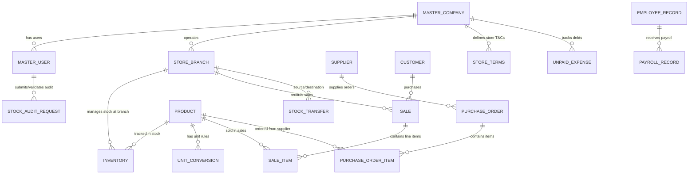

# Small Enterprise ERP - Entity-Relationship Diagram (ERD) & Database Schema Specifications

## Overview
This document specifies the database architecture and Entity-Relationship Diagram (ERD) for the Small Enterprise ERP system, designed to support multi-tenant companies (3 Company Tenants: Tenant 1, Tenant 2, Tenant 3) and 6 distinct user roles:
1. **Super Admin**: System T&Cs, Tenant Accounts (UC1, UC8)
2. **Owner**: Stores & Branches, Roles/Users, Reports, Terms/Credit Rules, Product Management (UC2, UC3, UC4, UC5, UC9, UC21)
3. **HR Manager**: Sales Reports, Unpaid Expenses, PO Fund Approvals, Payroll, Employee Records (UC4, UC6, UC7, UC14, UC15)
4. **Branch Manager**: Sales Reports, Stock Transfers (Request/Send), PO Validation, Product Management, Stock Audit Validation (UC4, UC11, UC12, UC18, UC21, UC25)
5. **Cashier**: Apply T&Cs on Sales, Process Sales & Cash Transactions, Issue Customer Receipts (UC10, UC19, UC20)
6. **Inventory Staff**: Receive Transfers, PO Creation, Delivery Receipt, Stock Adjustments, Box-to-Product Unit Conversion, Low Stock Tracking, Stock Audit Requests (UC13, UC16, UC17, UC22, UC23, UC24, UC25)

---

## Mermaid ERD Diagram

---

## Detailed Table Schemas

### 1. Master System Databases (`MasterCoreErpDbContext`)

#### `Companies` (Tenant Companies)
- `CompanyId` (INT, PK, Identity)
- `Name` (NVARCHAR(150), Required)
- `TenantEmail` (NVARCHAR(150), Unique, Required) - e.g. `tenant1@email`
- `IsActive` (BIT, Default: 1)
- `CreatedAt` (DATETIME2)

#### `Users` (Tenant Users & Staff)
- `UserId` (INT, PK, Identity)
- `CompanyId` (INT, FK -> Companies)
- `Email` (NVARCHAR(150), Unique) - e.g. `owner1@email`, `hr1@email`
- `PasswordHash` (NVARCHAR(256)) - Default: `123123`
- `FullName` (NVARCHAR(150))
- `Role` (NVARCHAR(50)) - Super Admin, Owner, HR Manager, Branch Manager, Cashier, Inventory Staff
- `IsActive` (BIT)

---

### 2. Tenant ERP Database Schemas (`TenantErpDbContext`)

#### `StoreBranches` (UC2)
- `BranchId` (INT, PK, Identity)
- `BranchName` (NVARCHAR(150))
- `Location` (NVARCHAR(250))
- `IsActive` (BIT)

#### `Products` (UC21)
- `ProductId` (INT, PK, Identity)
- `ProductCode` (NVARCHAR(50), Unique, Required)
- `ProductName` (NVARCHAR(200), Required)
- `UnitPrice` (DECIMAL(18,2))
- `IsActive` (BIT)

#### `Inventories` (UC22, UC24)
- `InventoryId` (INT, PK, Identity)
- `ProductId` (INT, FK -> Products)
- `BranchId` (INT, FK -> StoreBranches, Nullable)
- `QuantityOnHand` (DECIMAL(18,2))
- `ReorderLevel` (DECIMAL(18,2))
- `LastUpdatedAt` (DATETIME2)

#### `UnitConversions` (UC23 - Box to Product Conversion)
- `ConversionId` (INT, PK, Identity)
- `ProductId` (INT, FK -> Products)
- `UnitName` (NVARCHAR(50)) - e.g., "Box of 20 Units"
- `FactorToUnits` (DECIMAL(18,2)) - e.g., 20.0
- `BoxesInStock` (DECIMAL(18,2))

#### `StockAuditRequests` (UC25 - Physical Stock Audits)
- `AuditRequestId` (INT, PK, Identity)
- `ProductId` (INT, FK -> Products)
- `RequestedBy` (NVARCHAR(100)) - Inventory Staff
- `SystemQty` (DECIMAL(18,2))
- `PhysicalQty` (DECIMAL(18,2))
- `VarianceQty` (DECIMAL(18,2))
- `Status` (NVARCHAR(50)) - Pending, Approved, Rejected
- `ValidatedBy` (NVARCHAR(100)) - Branch Manager
- `CreatedAt` (DATETIME2)

#### `StockTransfers` (UC11, UC12, UC13 - Inter-Branch Operations)
- `TransferId` (INT, PK, Identity)
- `TransferNumber` (NVARCHAR(50))
- `SourceBranchId` (INT, FK -> StoreBranches)
- `DestBranchId` (INT, FK -> StoreBranches)
- `ProductId` (INT, FK -> Products)
- `Quantity` (DECIMAL(18,2))
- `Status` (NVARCHAR(50)) - Requested, Sent, Received
- `CreatedAt` (DATETIME2)

#### `Suppliers` & `PurchaseOrders` (UC7, UC16, UC17, UC18)
- `SupplierId` (INT, PK, Identity)
- `Name` (NVARCHAR(150))
- `ContactEmail` (NVARCHAR(150))
- `PurchaseOrderId` (INT, PK, Identity)
- `OrderNumber` (NVARCHAR(50))
- `SupplierId` (INT, FK -> Suppliers)
- `TotalAmount` (DECIMAL(18,2))
- `Status` (NVARCHAR(50)) - Draft, Validated (Manager), Funds Approved (HR Manager), Received (Inventory Staff)
- `CreatedAt` (DATETIME2)

#### `PurchaseOrderItems`
- `PurchaseOrderItemId` (INT, PK, Identity)
- `PurchaseOrderId` (INT, FK -> PurchaseOrders)
- `ProductId` (INT, FK -> Products)
- `Quantity` (DECIMAL(18,2))
- `UnitCost` (DECIMAL(18,2))
- `SubTotal` (DECIMAL(18,2))

#### `EmployeeRecords` & `PayrollRecords` (UC14, UC15)
- `EmployeeId` (INT, PK, Identity)
- `FullName` (NVARCHAR(150))
- `Role` (NVARCHAR(50))
- `BaseSalary` (DECIMAL(18,2))
- `PayrollId` (INT, PK, Identity)
- `EmployeeId` (INT, FK -> EmployeeRecords)
- `BaseSalary` (DECIMAL(18,2))
- `Bonuses` (DECIMAL(18,2))
- `Deductions` (DECIMAL(18,2))
- `NetPay` (DECIMAL(18,2))
- `Status` (NVARCHAR(50)) - Processed, Approved, Paid

#### `Sales` & `SaleItems` (UC10, UC19, UC20)
- `SaleId` (INT, PK, Identity)
- `InvoiceNumber` (NVARCHAR(50))
- `CustomerId` (INT, Nullable)
- `TotalAmount` (DECIMAL(18,2))
- `SaleDate` (DATETIME2)
- `SaleItemId` (INT, PK, Identity)
- `SaleId` (INT, FK -> Sales)
- `ProductId` (INT, FK -> Products)
- `Quantity` (DECIMAL(18,2))
- `UnitPrice` (DECIMAL(18,2))
- `SubTotal` (DECIMAL(18,2))

#### `StoreTerms` (UC8, UC9, UC10)
- `TermsId` (INT, PK, Identity)
- `ReturnPolicy` (NVARCHAR(MAX))
- `CreditRules` (NVARCHAR(MAX))
- `GeneralTerms` (NVARCHAR(MAX))

#### `UnpaidExpenses` (UC6)
- `ExpenseId` (INT, PK, Identity)
- `Title` (NVARCHAR(200))
- `Category` (NVARCHAR(100))
- `Amount` (DECIMAL(18,2))
- `DueDate` (DATETIME2)
- `IsPaid` (BIT)
